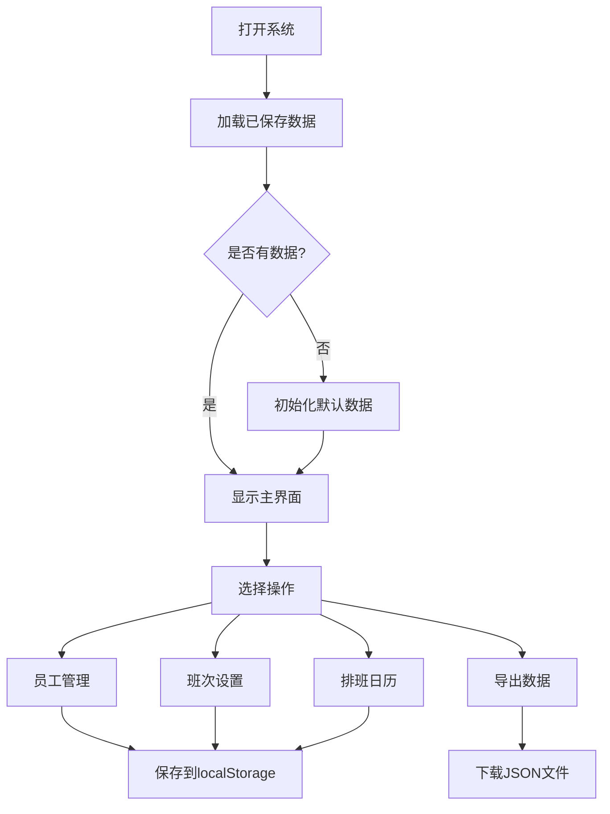

# 咖啡店员工排班系统 - 架构设计文档

## 项目概述
一个基于纯HTML/CSS/JavaScript的咖啡店员工排班系统原型，使用localStorage进行数据持久化。

## 系统架构

### 技术栈
- **前端**: 纯HTML5 + CSS3 + JavaScript (ES6+)
- **数据存储**: localStorage
- **样式**: 自定义CSS（响应式设计）
- **图标**: 可选使用Font Awesome或SVG图标

### 项目结构
```
coffee-shop-scheduler/
├── index.html              # 主入口页面
├── css/
│   ├── styles.css          # 主样式文件
│   └── calendar.css        # 日历组件样式
├── js/
│   ├── app.js              # 主应用逻辑
│   ├── employee.js         # 员工管理模块
│   ├── shift.js            # 班次管理模块
│   ├── schedule.js         # 排班管理模块
│   └── storage.js          # localStorage封装
└── assets/
    └── icons/              # 图标资源（可选）
```

## 功能模块设计

### 1. 员工管理模块 (Employee Management)
**功能**:
- 添加新员工（姓名、职位、联系方式）
- 编辑员工信息
- 删除员工
- 查看员工列表

**数据结构**:
```javascript
{
  id: string,           // 唯一标识
  name: string,         // 员工姓名
  position: string,     // 职位（店长、咖啡师、收银员等）
  phone: string,        // 联系电话
  email: string,        // 邮箱
  color: string         // 日历显示颜色
}
```

### 2. 班次管理模块 (Shift Management)
**功能**:
- 创建班次类型（早班、中班、晚班等）
- 设置班次时间
- 编辑/删除班次

**数据结构**:
```javascript
{
  id: string,           // 唯一标识
  name: string,         // 班次名称
  startTime: string,    // 开始时间 (HH:mm)
  endTime: string,      // 结束时间 (HH:mm)
  color: string         // 显示颜色
}
```

### 3. 排班日历模块 (Schedule Calendar)
**功能**:
- 周视图显示（7天）
- 月视图显示
- 点击日期分配班次
- 显示每日排班概览
- 切换视图模式

**数据结构**:
```javascript
{
  date: string,         // 日期 (YYYY-MM-DD)
  shifts: [
    {
      shiftId: string,  // 班次ID
      employeeId: string, // 员工ID
      status: string    // 状态（已确认/待确认）
    }
  ]
}
```

### 4. 数据持久化模块 (Storage)
**功能**:
- 封装localStorage操作
- 数据导入/导出（JSON格式）
- 数据初始化和备份

## 用户界面设计

### 主页面布局
```
+------------------------------------------+
|              咖啡店排班系统               |
+------------------------------------------+
|  [员工管理] [班次设置] [排班日历] [导出]  |
+------------------------------------------+
|                                          |
|           日历视图区域                    |
|                                          |
|  +----+----+----+----+----+----+----+    |
|  | 周一| 周二| 周三| 周四| 周五| 周六| 周日|    |
|  +----+----+----+----+----+----+----+    |
|  |    |    |    |    |    |    |    |    |
|  +----+----+----+----+----+----+----+    |
|                                          |
+------------------------------------------+
|           员工列表/操作面板               |
+------------------------------------------+
```

### 核心交互流程



## 实现步骤

### 阶段1: 基础框架
1. 创建HTML入口页面
2. 设置基础CSS样式
3. 创建JavaScript模块结构

### 阶段2: 数据层
1. 实现localStorage封装
2. 定义数据模型
3. 实现数据初始化

### 阶段3: 员工管理
1. 创建员工列表UI
2. 实现添加/编辑/删除功能
3. 表单验证

### 阶段4: 班次管理
1. 创建班次列表UI
2. 实现班次CRUD操作
3. 时间选择器

### 阶段5: 排班日历
1. 实现日历视图（周/月）
2. 点击分配班次
3. 显示排班详情

### 阶段6: 优化和完善
1. 响应式设计
2. 错误处理
3. 用户体验优化
4. 数据导出功能

## 数据初始化示例

系统首次启动时，将创建以下默认数据：

**默认班次**:
- 早班: 07:00 - 14:00
- 中班: 14:00 - 21:00
- 晚班: 21:00 - 23:00

**默认员工**:
- 示例员工1（咖啡师）
- 示例员工2（收银员）

## 扩展性考虑

未来可扩展的功能：
1. 多店铺支持
2. 员工偏好设置
3. 自动排班算法
4. 工时统计和报表
5. 员工请假管理
6. 班次交换功能
7. 消息通知
8. 移动端适配

## 技术要点

1. **模块化设计**: 使用ES6模块或命名空间避免全局污染
2. **事件委托**: 提高动态元素的事件处理效率
3. **数据验证**: 所有用户输入都需要验证
4. **错误处理**: 优雅地处理localStorage满载等异常情况
5. **性能优化**: 避免频繁的DOM操作，使用文档片段
